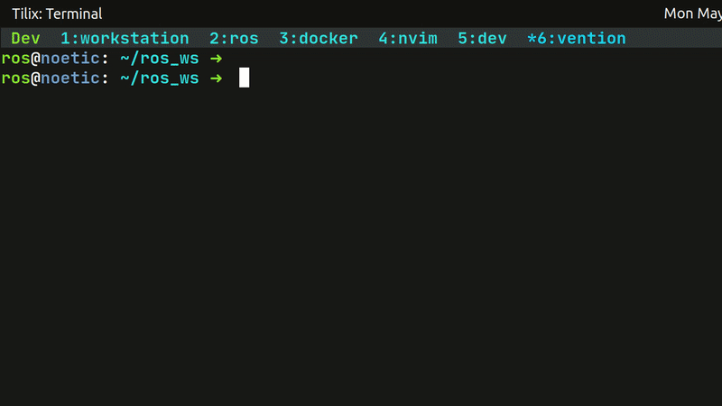

# Setup instructions
## Docker
To build the Docker image, run
```bash
docker build . -f Dockerfile --target dev -t noetic-vention:dev
```
To start the container, change directory into the package directory, and run the following
```bash
docker run -it -e DISPLAY=$DISPLAY -e DOCKER_REPO_TAG="noetic-vention:dev" -v $PWD:/home/ros/ros_ws/src/vention_example -v /tmp/.X11-unix:/tmp/.X11-unix -v ~/.ssh:/home/ros/.ssh -v ~/.zsh_history:/home/ros/.zsh_history -v ~/shared:/home/ros/shared --network host --hostname noetic --name noetic-vention noetic-vention:dev
```

## Creating a catkin workspace
This step is not necessary for the Noetic container
```bash
sudo apt-get update
sudo apt-get install -y \
  python3-catkin-tools
cd ~/ros_ws
catkin init
```

# Install ROS packages 
Assuming the packages are already cloned into `~/ros_ws/src`, then the dependencies can be installed using
```bash
cd ~/ros_ws/
rosdep update
rosdep install -i --from-path /home/ros/ros_ws/src --rosdistro noetic -y
```
Note that this step may take sometime.

# Building the package
```bash
# Build package
catkin build
```

# Running the example
```bash
# Source and run package
source devel/setup.bash
roslaunch vention_example pick_and_place_demo.launch
```

# Demo
A [video demo](vention_example_pick_and_place.mp4) is provided:


